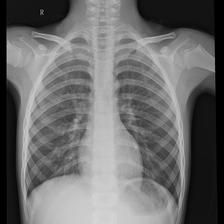
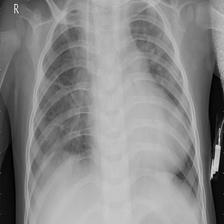
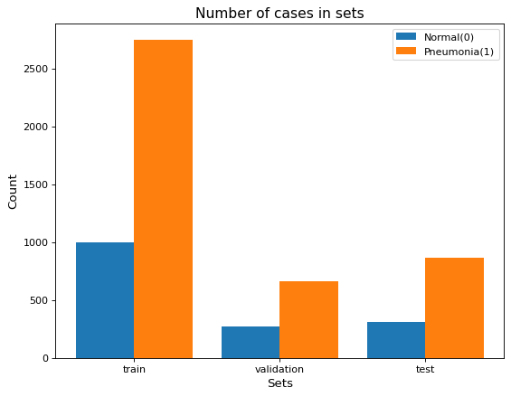

# PneunomiaDetection

### Authors

Lukas Benner (3277496)

Kevin Gavagan (2240332)

Lea Soffel (4962704)

## Abstract

In this article we describe the development of 3 coding approaches to detect Pneumonia disease on X-ray thorax images with the help of machine learning. Pneumonia is one of the most fatal infections worldwide, especially for young children under 5 and people over 65 the disease often ends deadly. Since young children often don't show any signs of Pneumonia, imaging methods such as X-ray or CT are used to detect the disease. In the past years the topic of using an AI to detect diseases has become an increasingly important issue. So why not let an AI do it for you?

- What is the result of our work?

## Introduction

Pneumonia is an inflammation of the lung tissue especially the air sacs in one or both lungs. Symptoms of Pneumonia are cough, shortness of breath, chest pain, fever and dyspnea. The symptomps vary depending on age, health problems, weakened immune system and type of germ, which causes the infection. For example young people often don't show any symtomps at all. Pneumonia is one of the most fatal infectious disease worldwide. In Germany around 400,000 to 600,000 people die per year because of Pneumonia. Especially for children under the age of 5 Pneumonia is the most fatal infection, killing more young people than maleria, AIDS and other diseases. Pneumonia is caused by microorganisms such as bacteria, viruses and funghi, which can be visualized by imaging methods as X-ray or CT. Pneumonia can have a mild to life-threatening course. Bacterial and viral agents are the popular causes but differ in their treatment methods. Bacterial pneumonia needs to be treated with antibiotics, whereas viral pneumonia is treated with antivirals and other supportive care. Therefore it is important to detect pneumonia in an early state to combat the bacteria or virus. 
Because of the fact that newborns often don't show any signs of the disease the possibility of detecting Pneumonia by imaging methods such as X-ray or CT is an important medical method. Additionally, X-ray is a standard treatment and can help differentiate between the different cause for the infection [1-5].

The image below shows X-ray thorax images of a person without pneumonia and a viral and a bacterial caused pneumonia [5].

We developed three different versions to train different network models.

- A Neural Network implemented and trained from scratch in python
- A Neural Network implemented and trained with tensorflow
- A Convolutional Neural Network implemented and trained with tensorflow

The goal is to see what different results each version produces, to analyze how they performed and to compare their advantages and disadvantages. Hereby we aim to put our theoretical knowledge to pratical use in the most comprehensive way, by creating three different versions. 

## Related Work

Our work is based on a dataset found on kaggle [2]. The original dataset was published on MendleyData and contains thousands of labeled Optical Coherence Tomography (OCT) and chest X-Ray images. The publisher is the University of California San Diego and the Guangthou Women and Children's Medical Center. [3] The data set is used in a lot of algorithms on kaggle. Taking a look at the activity overview in kaggle one can see, that the data set was downloaded more than 202,000 times and more than 1750 notebooks only on kaggle use the data set. [4] The approaches are very different, often they use CNN as network, but some also use transfer learning. The project of the University San Diego itself dispicts the developement of a transfer learning algorithm in diagnosis of retinal OCT images which is then used as pretrained algorithm to detect pneunomia on X-ray iamges [5].
The neural network from scratch is based on the course material. The neural network with tensorflow also uses the course material and the tensorflow beginner tutorial. [6] The CNN is based on an article on Medium [7].

In case of this dataset there are a lot of different projects and notebooks, but our goal was to do as much as possible only by using the course material.

## Dataset and Features

Our work is based on a data set found on kaggle [2]. 

The X-ray images are from patients aged one to five from Guangzhou Women and Children's Medical Center [4]. 

The dataset contains 5,856 labelled X-ray thorax images (JPEG). These images are split into to sets, a training set and a test set. Each set is divided into two sets, NORMAL and PNEUNOMIA. For training we have 5,232 images divided into 1,349 NORMAL and 3,883 PNEUMONIA. To test the algorithm we have 624 images divided into 234 NORMAL and 390 PNEUMONIA. 

The amount of images being classified as PNEUMONIA is 4273. The number of images being classified as NORMAL is 1583, so the images classified as PNEUMONIA account for 73% of the data set. Therefore the dataset is imbalanced!

The accuracy metric will therefore not be as meaningful as with a balanced dataset.
A very weak model, which classifies all images as PNEUMONIA, will reach an accuracy of about 73%.

The original images vary in size but overall most exceed over at least 1000 pixels in width. Therefore we wrote a python script to down scale all images, to make it easier to train the Networks.

We scaled the images to 224x224 for both tensorflow versions. For the Neural Network from scratch we scaled the images to 56x56. The reason will be explained in chapter "Neural Network from scratch".
You can find the python script in the repository as well (PythonImageScaler.py).

We also normalized all pixel values from each image from 0-255 to 0.0-1.0.

Besides the two mentioned modifications we didn't perform any further data augmentations on the images. X-ray scans from the chest are always taken one specific way and variations such as flips and rotations will not exist in real X-ray images. That's why we didn't choose to implement more data augementations.

As inputs to our Networks we will use all the pixel color values from one image. All images are given as grayscale images. This means each pixel can be described by just a single value rather than three, as this is the case for RGB values.

This dataset is treated as a classification problem. Here we only classify two different cases. Either the X-ray shows no signs of an infection ("NORMAL") or one can see Pneumonia developing in the lungs ("PNEUMONIA"). In the code we represent this binary classification as numbers:

- "NORMAL" : 0
- "PNEUMONIA" : 1

Example for a NORMAL X-ray thorax (downscaled 224x2224):

Example for a PNEUMONIA X-ray thorax (downscaled 224x2224):

## Methods

### Neural network from scratch

We wanted to be as flexible as possible, which is why we implemented the possibility to choose different number of neurons per hidden layer and the number of hidden layers.

All hidden layers use as an activation function the Relu-function. Only the very last layer uses the sigmoid function to produce a probability that its either one (“Pneumonia”) or zero (“Normal”).

For the neural network we took the distribution of the dataset. We decided to do nnt tune our hyperparameters because of the flexibility the amount of layers and amount of neurons per layer and depending on the regularization mode lambd and keep_probability are also hyperparameters.

The distribution we used is the following:

|                  | Total | Training set | Test set |
| ---------------- | ----- | ------------ | -------- |
| Number of Images | 5,856 | 5,232        | 624      |
| Percentage       | 100%  | 89,34%       | 10,66%   |

As means of training the network, we use Batch Gradient Descent. This is the most CPU-intensive algorithm. It goes through all images of the train set and calculates gradients for each of the parameters. These determine how much and in which direction the weights should be updated to lower the cost.

Overfitting very quickly became a problem in our model. We implemented both L2-Regularization and Dropout to manage the relatively low accuracy on the test set. 

L2-Regularization works by punishing higher weights in the model. This is done by creating the sum of all weights squared and letting this influence the overall cost of the model. Are the parameters high, then the cost will be high as well.

The Dropout solutions works by deactivating random neurons in the network. With the “keep probability”-value, one can determine how many neurons will be deactivated, but it’s not possible to control which ones. This solution helps to reduce the size of the Neural Network whilst training it, which is a key component treating overfitting.

The loss function we use, is the logistic loss which is expressed by the following formula:

$\mathcal{L}(\hat{y},y)=-(y^{(i)}*log_{10}(\hat{y}^{(i)})+(1-y^{(i)})*log_{10}(1-\hat{y}^{(i)}))$

The training of the network proofed to be rather cumbersome to even do with the scaled version of 224x224 Pixels. This is the reason why Neural Networks are not as good as Convolutional Neural Networks in Image Classification and Computervision in general. Therefore, we reduced the size even more, to a size of 54x54 Pixels.

### Neural network with Tensorflow

The second algorithm is also a neural network but it uses Tensorflow. With the help of keras we load the data, create a model and predict the output.

In order to use Tensorflow we changed the distribution of the dataset.
We combined the training and test data and redistributed the data.

The distribution is now the following:

- 64% training set
- 16% validation/dev set
- 20% test files

The model uses the "Adam" optimizer and the loss function is the binary cross-entropy one.
We used drop out to reduce overfitting and implemented a correction for the imbalanced dataset.

In a second training step with fine tuning, we use keras callbacks for checkpoints, early stopping and learning rate decay.
The checkpoint callback saves the best weights of the model. The early stopping callback stops the training if the model becomes stagnant or if the model starts overfitting. The learning rate decay callback is used to implement a exponential learning rate decay.

The performance of the model is measured by loss, accuracy, precision, and recall.

The architecture of the model is number of fully connected with relu activation functions.
The output layer is a single neuron with a sigmoid activation function.

We didn't decide on one specific architecture because we wanted to try different architectures and compare the results.

### Convolutional neural network with Tensorflow

The model is built using a convolutional neural network composed by five convolutional blocks comprised of convolutional layer, max-pooling and batch-normalization, a flatten layer and four fully connected layers.

The architecture was inspired by this [article](https://towardsdatascience.com/deep-learning-for-detecting-pneumonia-from-x-ray-images-fc9a3d9fdba8).

The CNN uses the same dataset, optimizer and callbacks as the NN described above.

## Experiments/Results/Discussion

In the following chapters we are going to describe the training results and discuss how the different models perform on the given problem.

### Neural network from scratch

We trained the model with a lot of different parameter combinations and layer sizes, but we always had the problem of overfitting. We tried to work against the overfitting by adding regularization which did not bring the desired effect. We measured the performance of the model by accuracy, precision and recall. To show some different NN architectures and their results we created a comparison. The comparison can be found in an extra file (assets/trainingResults/from_scratch_nn/AllTraininResults.pdf). For each NN architecture we trained three times to cover the cases: no regularization, L2 regularization and dropout.

As one can see in the comparison the best result can be reached by using a neural network with one hidden layer with a high amount of neurons, in this case 1000 and L2 regularization.
This model scores the following values:

- Test Accuracy: ~82.5%

- Training Accuracy: ~95%

- Recall: 97,91%

- Precision: 95,84%

It is noticeable that overfitting is still present, the difference between test and training accuracy is about 7%. Our conclusion is that we need more data to reduce the overfitting. Unless the overfitting our model performs well, recall and precision value are both very high which is important in our case. Especially recall because a high recall determines ???.

### Neural network with Tensorflow

We trained the model with the following parameters:

- Batch size: 32

- Number epochs: 30

- initial learning rate: 0.1

After the training was completed, the model scored the following values on the test set:

- Loss: 0.6502

- Accuracy: 0.7628

- Precision: 0.7559

- Recall: 1.0000

- F1: 0.861

As expected, according to the F1 and the accuracy score, this model didn't perform as good as the CNN. 

### Convolutional neural network with Tensorflow

As expected, the convolutional neural network performed very well.

We trained the model with the following parameters:

- Batch size: 32

- Number epochs: 30

- initial learning rate: 0.1  

After the training was completed, the model scored the following values on the test set:

- Loss: 0.1132

- Accuracy: 0.9556

- Precision: 0.9915

- Recall: 0.9477

- F1: 0.9874

According to the F1 score the model performs very good. 

In the case of pneumonia, a higher recall would be preferable to a high precision. The reason is that the probability of a person with pneumonia being classified as such should idealy be 100%.

## Conclusion

We did not have that one goal to reach, what we wanted to do is implementing three different models and compare them. Overall one can say, that the CNN model has the best outputs. 

## References

- [1] https://www.lungeninformationsdienst.de/krankheiten/lungenentzuendung/verbreitung
- [2] https://www.kaggle.com/datasets/tolgadincer/labeled-chest-xray-images
- [3] https://data.mendeley.com/datasets/rscbjbr9sj/2
- [4] https://www.kaggle.com/datasets/paultimothymooney/chest-xray-pneumonia
- [5] https://www.cell.com/cell/fulltext/S0092-8674(18)30154-5
- [6] https://www.tensorflow.org/tutorials/quickstart/beginner
- [7] https://towardsdatascience.com/deep-learning-for-detecting-pneumonia-from-x-ray-images-fc9a3d9fdba8

