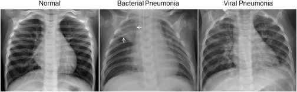

# PneunomiaDetection

### Author
Lukas Benner (3277496)

Kevin Gavagan (2240332)

Lea Soffel (4962704)

## Abstract
In this article we describe the development of 3 coding approaches to detect Pneumonia disease on X-ray thorax images with the help of machine learning. Pneumonia is one of the most fatal infections worldwide, especially for young children under 5 and people over 65 the disease often ends deadly. Since young children often don't show any signs of Pneumonia, imaging methods such as X-ray or CT are used to detect the disease. In the past years the topic of using an AI to detect diseases has become an increasingly important issue. So why not let an AI do it for you?

- What is the result of our work?

## Introduction
Pneumonia is an inflammation of the lung tissue especially the air sacs in one or both lungs. Symptoms of Pneumonia are cough, shortness of breath, chest pain, fever and dyspnea. The symptomps vary depending on age, health problems, weakened immune system and type of germ, which causes the infection. For example young people often dont show any symtomps at all. Pneumonia is one of the most fatal infectious disease worldwide. In Germany around 400,000 to 600,000 people die per year because of Pneumonia disease. Especially for children under 5 it is the most fatal infection, killing more young people than maleria, AIDS and other diseases. Pneumonia is caused by microorganisms such as bacteria, viruses and funghi, which can be visualized by imaging methods as X-ray or CT. Pneumonia can have a mild to life-threatening course. Bacterial and viral agents are the popular causes but differ in their treatment methods. Bacterial pneumonia needs to be treated with antibiotics, whereas viral pneumonia is treated with antivirals and other supportive care. Therefore it is important to detect pneumonia in an early state to combat the bacteria or virus. 
Because of the fact that newborns often dont show any signs of the disease the possibility of detecting Pneumonia by imaging methods such as X-ray or CT is an important medical method. Additionally, X-ray is a standard treatment and can help differentiate between the different cause for the infection [1-5].

The image below shows X-ray thorax images of a person without pneumonia and a viral and a bacterial caused pneumonia [5].

The goal of this work is to generate an AI which detects Pneumonia on a X-ray thorax image. Input is an grayscale image (224x224) of a X-ray thorax, with the help of a neural network, which we developed the algorithm outputs a 0 or a 1. 0 means no pneumonia, where as 1 means pneumonia is detected. In the future the use of the algorithm could be to support or validate the decision of doctors.

## Related Work
Our work is based on a data set found on kaggle [2]. The data set is used in a lot of algorithms found on kaggle. The Approaches are very different, often they use CNN as network. Another project was found from University of California San Diego [3].
HIER MUSS NOCH MEHR CONTEXT HIN

## Dataset and Features
Our work is based on a data set found on kaggle [2]. 

The X-ray images are from patients age one to five from Guangzhou Women and Children's Medical Center [4]. 

The dataset contains 5,856 labeled X-ray thorax images (JPEG). These images are split into to sets, a training set and a test set. Each set is divided into two sets, NORMAL and PNEUNOMIA. For training we have 5,232 images divided into 1,349 NORMAL and 3,883 PNEUMONIA. To test the algorithm we have 624 images divided into 234 NORMAL and 390 PNEUMONIA. 

|                 | Total | Training set | Test set |
| --------------- | ----- | ------------ | -------- |
|Number of Images | 5,856 | 5,232        |  624     |
|Percentage       | 100%  | 89,34%       | 10,66%   |

The original image size varies and is extremely big, so we wrote a python script to down scale all images. 

In order to compare the performance between two different image resolutions we decided to scale the images to 224x224 and 56x56.
You can find the python script in the repository (PythonImageScaler.py). 

Because of the fact that we use grayscale images we only need one color attribute per pixel, instead of three (RGB).

Example for a NORMAL X-ray thorax:

Example for a PNEUMONIA X-ray thorax:

We didn't do any more data augmentation because X-ray scans are only taken in a specific orientation, and variations such as flips and rotations will not exist in real X-ray images.

## Methods

We decided that we would like to compare the performance of a neural network and a convolutional neural network.

Implementing the neural network we wanted to try implementing it from scratch and compare it to a Tensorflow neural network afterwards. 

Because implementing a convolutional network from scratch seems pretty complicated, we decided to use Tensorflow to build the CNN.

Therefore we implemented three different solutions.

### 1. Neural network from scratch

We wanted to be as flexible as possible, which is why we also implemented the possibility to choose different amount and size of the hidden layers. The hyperparameters lambda, learning rate and number of iterations are also adjustable. 

We did not implement the training of the hyperparameters.

cost function: ?

hyperparameter: ?

architecture: ?

### 2. Neural network with Tensorflow

The second algorithm is also a neural network but it uses Tensorflow. With the help of keras we load the data, create a model and predict the output.

loss function: ?

hyperparameter: ?

architecture: ?

### 3. Convolutional neural network with Tensorflow

The third algorithm is a convolutional neural network.

cost function: ?

hyperparameter: ?

architecture: ?

The reason why we decided to implement all three methods is that we wanted to compare the efficeincy, the accuracy and the computational effort of these three. More about this later.

## Experiments/Results/Discussion

Wichtige Erkenntnisse:
- Accuracy ist hier nicht so aussagekräftig durch die ungleichmäßige Aufteilung der Daten
- 

## Conclusion

## References
- [1] https://www.lungeninformationsdienst.de/krankheiten/lungenentzuendung/verbreitung
- [2] https://www.kaggle.com/datasets/tolgadincer/labeled-chest-xray-images
- [3] https://data.mendeley.com/datasets/rscbjbr9sj/2
- [4] https://www.kaggle.com/datasets/paultimothymooney/chest-xray-pneumonia
- [5] https://www.cell.com/cell/fulltext/S0092-8674(18)30154-5
